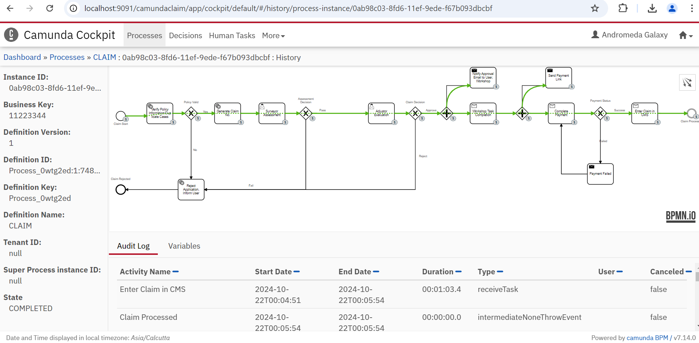

# Camunda POC
## Workflow management

This POC includes Camunda BPMN file to be deployed on a server, using Spring Boot java to consume topics/events to and from this deployment.
Also included is a Postman collection to send messages to Camunda server to "notify" completion of tasks.

Purpose of this illustration is to show a workflow process for insurance claims starting from *Claim being filed -> Surveyor Assessment -> Adjustor Approval -> Workshop repair completion -> Payment -> Claim success*.
The actual code for above is mocked. The listenere services will consume topics from Camunda deployment, and Postman collection has APIs to provide events to Camunda server.

### **Prerequisites**
- Camunda Modeler application is installed/ Web Modeler can be used to view process like 'https://demo.bpmn.io/'
- Camunda server will be deployed and running on URL http://localhost:9091/
- Postman application installed.
- maven installed
- IDE to run JAVA application

### **Deploy Camunda file**
- Claim process will be auto deployed once application is run as java application
- Following will be Camunda server engine URL http://localhost:9091/engine-rest (change as needed)

### **Run Spring boot app**
- Use maven command to compile, mvn clean install
- Use any IDE to run JAVA application. Application.java is main file.

### **Import Postman collection**
- Go to Postman application and click on Import
- Select file `CLAIMS_POC.postman_collection.json` (in `postman_collection` folder) and import it.

### **Test flow of workflow**
After completing the above steps:
1. Go to postman collection and run the `START CLAIM PROCESS` API.
    - This will initiate the claims workflow.
2. Flow will move to the first task: `Verify Policy information/Duplicate cases`. This is an automated task, where based on data inserted into claim request it will verify whether policy is valid or not along with duplicate request for claims. In case of valid cased only request will be proceed for further processing otherwise it will be rejecetd.
Java File for same is ClaimPreCheck.Java under `com.bpm.workflow.worker`.
3. Flow will now move to next task `Generate Claim Number`. This is a `service task` i.e. code logic for any Specific Claim number generation etc can be implemted.
4. Flow will now move to next task `Surveyor Assessment`. Before reaching this task, system will assign the request to User available under Adjustor Group. This can be done in Round Robin or one having least task anymanner in which it is desire. 
This is a `user task` i.e. User have to login into camunda system & process the request. Same can be achieved by using PostMan Request
    - From postman, call the `2(a).Get Process Task ID` API & use the task id from response in next request
    - From postman, call the `2(b). Surveyor Assessment` API.
    - This will completion this task.
4. Flow will move to the `Adjustor evaluaation` task.
    - Similar to surveyor this can be also assigned to available user from Group Adjustor.
    - This is a `user task`  which can be complete from camunda or From postman, call the `ADJUSTOR ASSESSMENT` API.
    - From postman, call the `3(a).Get Process Task ID` API & use the task id from response in next request
    - call the `3(b). Adjustor Assessment` 
    - This will mark completion of this task.
5. Now the `Notify Approval  and Send Payment Link` will be called parallelly
    - From postman, call the `4. WORKSHOP COMPLETE` API.
    - This will mock completion of this task.
6. Now call for payment journey
	- From postman, call the `5. PAYMENT COMPLETE` API.
    - This will mock completion of this task.
7. After mocking successful payment, flow will move to the `Vehicle delivered / collected` task.
    - From postman, call the `6. CLAIM COMPLETE` API.
    - This will mock completion of this task.
8. Finally, flow will reach the end event, which will be consumed in the React frontend app. It will display a final console message, and workflow will be completed.